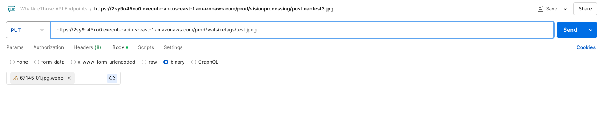
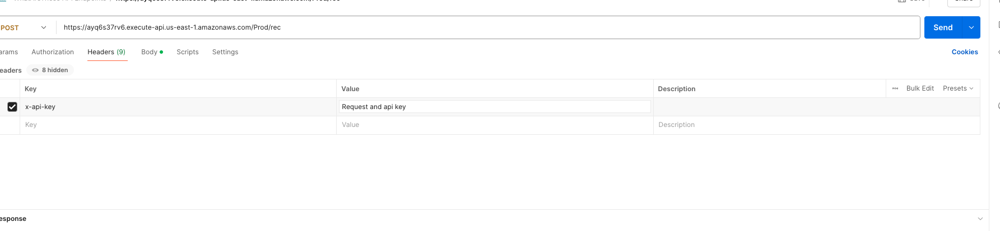

#  WAT API Documentation

# **_Identification API’s_**

## **Overview**

Our Identification APIs recognize sneaker products in an image. We have a two-step identification process and this documentation goes through each API endpoint, the output, and request types.

## **Endpoints**

## **1) Name:** Image-Store

—-------------------------------

**Type:** PUT

**Parameters:** Name of the filepath of where the image should be written or uploaded 

(ex. “Image.jpg”, “Directory/Image.jpg”)

**Overview:** This endpoint first uploads the image that needs to be recognized to a storage directory (preferably a cloud storage system). This requires sending a put request with the file path of where the image should be stored (including extension) as a parameter. The payload will be a binary file for the image. It’s required to send the request with the URL path of where the image will be written or uploaded, and the payload being the image itself. 

### **Request Method Example:**

PUT: [https://2sy9o45xo0.execute-api.us-east-1.amazonaws.com/prod/wat-api-integrations/image-store/](https://2sy9o45xo0.execute-api.us-east-1.amazonaws.com/prod/wat-api-integrations/image-store/CAP_00396A43-AB39-4089-B9B9-81A7513C32C4.jpg)&lt;IMAGE.JPEG> 

<table>
  <tr>
   <td>Headers
   </td>
   <td>Value
   </td>
  </tr>
  <tr>
   <td>
    Content-Type

    	
   </td>
   <td>
    image/jpeg | image/jpg | ”image/png 

    Choose one of these
   </td>
  </tr>
  <tr>
   <td>
    Access-Control-Allow-Origin
   </td>
   <td>*
   </td>
  </tr>
</table>

**Response Example:**

**Note**: First check the status field for the response code.

200 - The image was successfully uploaded.

    	

400 - Error in the request

500 - Internal server error

## **2) Name:** Recognition

—--------------------------------

**Type: **POST

**Parameters:** JSON body with an “image” field whose value is the name of the image file to be identified.

**Overview: **This endpoint requires passing the file name used in the image-store endpoint. The rec/ endpoint will run our recognition model and return a result for different listings, of the item that was scanned.

### **Request Method Example:**

POST: [https://ayq6s37rv6.execute-api.us-east-1.amazonaws.com/Stage/rec](https://ayq6s37rv6.execute-api.us-east-1.amazonaws.com/Stage/rec) 

	

<table>
  <tr>
   <td>Headers
   </td>
   <td>Values
   </td>
  </tr>
  <tr>
   <td>x-api-key
   </td>
   <td>API Key
   </td>
  </tr>
  <tr>
   <td>Content-Type
   </td>
   <td>application/json
   </td>
  </tr>
</table>

### **Response Example:**

200 - Will return a JSON array of names, images, links, and prices for the item that was scanned

<!-- watermark -->

gd2md-html: xyzzy Thu Aug 15 2024

